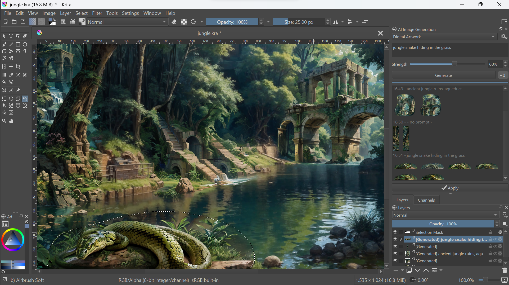

<h1> Generative AI <i>for Krita</i></h1>

[Features](#features) | [Download](https://github.com/Acly/krita-ai-diffusion/releases/latest) | [Installation](#installation) | [Video](https://youtu.be/Ly6USRwTHe0) | [Screenshots](#screenshots)

Generate images from within Krita with minimal fuss: Select an area, push a button,
and new content that matches your image will be generated. Or expand your canvas and
fill new areas with generated content that blends right in. Text prompts are optional.
No tweaking required!

This plugin seeks to provide what "Generative Fill/Expand" do in Photoshop - and go beyond.
Adjust strength to refine existing content _(img2img)_ or generate images from scratch.
Powerful customization is available for advanced users.

_Local. Open source. Free._

##  Features

Features are designed to fit an interactive workflow where AI generation is used as just another
tool while painting. They are meant to synergize with traditional tools and the layer stack.

* **Inpaint**: Use Krita's selection tools to mark an area and remove or replace existing content in the image. Simple text prompts can be used to steer generation.
* **Outpaint**: Extend your canvas, select a blank area and automatically fill it with content that seamlessly blends into the existing image.
* **Generate**: Create new images from scratch by decribing them with words. Supports SD1.5 and SDXL.
* **Refine**: Use the strength slider to refine existing image content instead of replacing it entirely. This also works great for adding new things to an image by painting a (crude) approximation and refining at high strength!
* **Control**: Guide image creation directly with sketches or line art. _Work in progress, more control modes coming soon!_
* **Resolutions**: Work efficiently at any resolution. The plugin will automatically use resolutions appropriate for the AI model, and scale them to fit your image region.
* **Job Queue**: Depending on hardware, image generation can take some time. The plugin allows you to queue and cancel jobs while working on your image.
* **History**: Not every image will turn out a masterpiece. Preview results and browse previous generations and prompts at any time.
* **Strong Defaults**: Versatile default style presets allow for a simple UI which covers many scenarios.
* **Customization**: Create your own presets - select a Stable Diffusion checkpoint, add LoRA, tweak samplers and more.

##  Getting Started

The plugin comes with an integrated installer for the Stable Diffusion backend.

### Requirements

* Windows or Linux (MacOS is untested)
* _On Linux:_ Python + venv must be installed (available via package manager, eg. `apt install python3-venv`)

#### Hardware support

To run locally a powerful graphics card with at least 6 GB VRAM is recommended. Otherwise generating images will take very long!

<table>
<tr><td>NVIDIA GPU</td><td>supported via CUDA</td></tr>
<tr><td>AMD GPU</td><td>supported via DirectML, Windows only</td></tr>
<tr><td>CPU</td><td>supported, but very slow</td></tr>
<tr><td>Cloud GPU</td><td>supported, rent a GPU on an hourly basis, see <a href="#gpu-cloud">below</a></td></tr>
</table>

### Installation

1. If you haven't yet, go and install [Krita](https://krita.org/)! _Recommended version: 5.2.0_
1. [Download the plugin](https://github.com/Acly/krita-ai-diffusion/releases/latest). Unpack the archive into your `pykrita` folder.
    * _Windows:_ Usually `C:\Users\<user>\AppData\Roaming\krita\pykrita`
    * _Linux:_ Usually `~/.local/share/krita/pykrita`
    * Check [Krita's official documentation](https://docs.krita.org/en/user_manual/python_scripting/install_custom_python_plugin.html) if you have trouble locating it.
1. Enable the plugin in Krita (Settings ‣ Configure Krita ‣ Python Plugins Manager) and restart.
1. To show the plugin docker: Settings ‣ Dockers ‣ AI Image Generation.
1. In the plugin docker, click "Configure" to start server installation. _Requires ~10 GB free disk space._

### GPU Cloud

You can also rent a GPU instead of running locally. In that case, step 5 is not needed. Instead use the plugin to connect to a remote server.

There is a [step by step guide](https://github.com/Acly/krita-ai-diffusion/blob/main/doc/cloud-gpu.md) on how to setup cloud GPU on [runpod.io](https://www.runpod.io) or [vast.ai](https://vast.ai).

### _Optional:_ Custom ComfyUI Server

The plugin uses [ComfyUI](https://github.com/comfyanonymous/ComfyUI) as backend. As an alternative to the automatic installation,
you can install it manually or use an existing installation. If the server is already running locally before starting Krita, the plugin will
automatically try to connect. Using a remote server is also possible this way.

To use an external installation, the following extensions and models are required:
* ComfyUI custom nodes:
  * [ControlNet preprocessors](https://github.com/Fannovel16/comfyui_controlnet_aux)
  * [IP-Adapter](https://github.com/cubiq/ComfyUI_IPAdapter_plus)
  * [External tooling nodes](https://github.com/Acly/comfyui-tooling-nodes)
* Model files (paths are relative to ComfyUI install folder):
  * [ControlNet inpaint](https://huggingface.co/comfyanonymous/ControlNet-v1-1_fp16_safetensors/resolve/main/control_v11p_sd15_inpaint_fp16.safetensors) to `models/controlnet`
  * [Clip-Vision (SD1.5)](https://huggingface.co/h94/IP-Adapter/resolve/main/models/image_encoder/pytorch_model.bin) to `models/clip_vision/SD1.5`
  * [IP-Adapter (SD1.5)](https://huggingface.co/h94/IP-Adapter/resolve/main/models/ip-adapter_sd15.bin) to `custom_nodes/IPAdapter-ComfyUI/models`
  * [NMKD Superscale SP_178000_G](https://huggingface.co/gemasai/4x_NMKD-Superscale-SP_178000_G/resolve/main/4x_NMKD-Superscale-SP_178000_G.pth) to `models/upscale_models`

##  Screenshots

_Inpainting on a photo using a realistic model_

_Reworking and adding content to an AI generated image_

_Adding detail and iteratively refining small parts of the image_

_Using ControlNet to guide image generation with a crude scribble_

_Server installation_

_Style preset configuration_

## Technology

* Image generation: [Stable Diffusion](https://github.com/Stability-AI/generative-models)
* Diffusion backend: [ComfyUI](https://github.com/comfyanonymous/ComfyUI)
* Inpainting: [ControlNet](https://github.com/lllyasviel/ControlNet), [IP-Adapter](https://github.com/tencent-ailab/IP-Adapter)